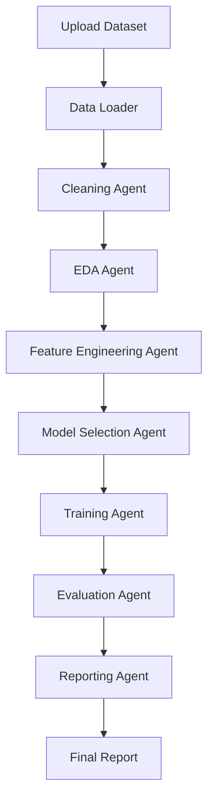

# 🚀 Autonomous Data Science Agent

<p align="center">


</p>

---

# 📊 Autonomous Data Science Agent

### Building an End-to-End Multi-Agent AI System for Automated Data Science

A production-oriented portfolio project that combines **Data Science**, **Machine Learning**, **Agentic AI**, **LangGraph**, **FastAPI**, and **Vector Databases** to create an autonomous system capable of performing the complete data science lifecycle.

---

# 🎯 Project Overview

Autonomous Data Science Agent is a multi-agent AI system designed to automate major stages of a real-world data science workflow.

The system can:

* Accept CSV datasets
* Validate and clean data
* Perform exploratory data analysis (EDA)
* Generate visualizations
* Engineer features
* Select machine learning models
* Train and evaluate models
* Explain model performance
* Generate reports
* Maintain workflow state using LangGraph
* Expose functionality through FastAPI
* Store metadata in relational databases
* Utilize vector databases for memory and retrieval

This project is being built over an **8-week engineering roadmap** with a strong focus on:

* Software Engineering
* Data Science
* Machine Learning
* Agentic AI Systems
* Backend Development
* Production Architecture

---

# ✨ Key Features

## Data Ingestion

* CSV dataset upload
* Dataset validation
* Metadata extraction

## Data Cleaning

* Missing value handling
* Duplicate removal
* Datatype correction
* Outlier detection

## Exploratory Data Analysis

* Summary statistics
* Correlation analysis
* Distribution analysis
* Automated insights

## Visualization

* Histograms
* Scatter plots
* Box plots
* Correlation heatmaps

## Feature Engineering

* Encoding
* Scaling
* Normalization
* Feature generation

## Machine Learning

* Model selection
* Model training
* Cross-validation
* Hyperparameter tuning

## Explainability

* Feature importance
* Model comparison
* Performance interpretation

## Reporting

* HTML reports
* PDF reports
* Markdown reports

## Agentic AI

* Specialized autonomous agents
* Shared workflow state
* Multi-agent orchestration
* LangGraph execution graph

---

# 🏗 System Architecture Overview

```text
User
 │
 ▼
FastAPI
 │
 ▼
LangGraph Workflow
 │
 ├── Cleaning Agent
 ├── EDA Agent
 ├── Feature Agent
 ├── Model Agent
 ├── Evaluation Agent
 └── Reporting Agent
 │
 ▼
Database + Vector Store
 │
 ▼
Generated Insights & Reports
```

---

# 🤖 Agent Architecture

Each agent is responsible for a specific domain task.

| Agent            | Responsibility                  |
| ---------------- | ------------------------------- |
| Cleaning Agent   | Data cleaning and preprocessing |
| EDA Agent        | Exploratory data analysis       |
| Feature Agent    | Feature engineering             |
| Model Agent      | Model selection and training    |
| Evaluation Agent | Performance analysis            |
| Reporting Agent  | Report generation               |

Benefits:

* Separation of concerns
* Better maintainability
* Easier scalability
* Reusable workflows

---

# 🔄 Workflow Diagram



---

# 🧠 Why LangGraph?

LangGraph was selected because it provides:

* Stateful workflows
* Multi-agent orchestration
* Conditional execution
* Memory support
* Agent communication
* Production-grade workflow management

Unlike simple chains, LangGraph allows the project to model real-world autonomous workflows where agents collaborate and share context.

---

# 🛠 Technology Stack

## Programming

* Python 3.11+

## Data Science

* Pandas
* NumPy

## Machine Learning

* Scikit-Learn

## Visualization

* Plotly

## API Layer

* FastAPI
* Uvicorn

## Agent Framework

* LangGraph
* LangChain

## Databases

* SQLite
* PostgreSQL

## Vector Databases

* ChromaDB
* Qdrant

## Testing

* Pytest

## Version Control

* Git
* GitHub

---

# 📁 Folder Structure

```text
autonomous-data-science-agent/
│
├── app/
│   ├── agents/
│   ├── workflows/
│   ├── tools/
│   ├── services/
│   ├── database/
│   ├── vectorstore/
│   ├── api/
│   ├── core/
│   └── main.py
│
├── data/
│   ├── raw/
│   ├── processed/
│   ├── sample/
│   └── exports/
│
├── reports/
│   ├── html/
│   ├── pdf/
│   └── figures/
│
├── notebooks/
│
├── tests/
│
├── docs/
│
├── config/
│
├── assets/
│
├── .github/
│   └── workflows/
│
├── requirements.txt
├── requirements-dev.txt
├── README.md
└── LICENSE
```

---

# ⚙️ Installation Guide

Clone repository:

```bash
git clone https://github.com/SulakshanCGhimire/autonomous-data-science-agent.git

cd autonomous-data-science-agent
```

Create virtual environment:

```bash
python -m venv venv
```

Activate:

Windows:

```bash
venv\Scripts\activate
```

Linux/Mac:

```bash
source venv/bin/activate
```

Install dependencies:

```bash
pip install -r requirements.txt
```

---

# 🔐 Environment Setup

Create:

```bash
.env
```

Example:

```env
DATABASE_URL=sqlite:///app.db

VECTOR_DB=chromadb

API_HOST=0.0.0.0

API_PORT=8000
```

---

# ▶ Running the Application

```bash
python app/main.py
```

---

# 🌐 Running the API

```bash
uvicorn app.api.routes:app --reload
```

Access:

```text
http://localhost:8000
```

Swagger Docs:

```text
http://localhost:8000/docs
```

---

# 📡 Example API Requests

## Upload Dataset

```http
POST /upload
```

Example:

```json
{
  "file": "customers.csv"
}
```

---

## Analyze Dataset

```http
POST /analyze
```

Example:

```json
{
  "dataset_id": "123"
}
```

---

## Generate Report

```http
POST /report
```

Example:

```json
{
  "dataset_id": "123"
}
```

---

# 📊 Example Dataset Workflow

```text
Upload CSV
      ↓
Validation
      ↓
Cleaning
      ↓
EDA
      ↓
Feature Engineering
      ↓
Model Selection
      ↓
Training
      ↓
Evaluation
      ↓
Report Generation
```

---

# 🤖 Machine Learning Pipeline

```text
Dataset
   ↓
Preprocessing
   ↓
Feature Engineering
   ↓
Train/Test Split
   ↓
Model Selection
   ↓
Training
   ↓
Evaluation
   ↓
Explainability
```

---

# 👨‍💻 Agent Responsibilities

### Cleaning Agent

* Detect missing values
* Remove duplicates
* Correct datatypes

### EDA Agent

* Generate statistics
* Produce visualizations
* Identify correlations

### Feature Agent

* Create features
* Encode categories
* Scale data

### Model Agent

* Select models
* Train models
* Compare performance

### Evaluation Agent

* Calculate metrics
* Rank models

### Reporting Agent

* Generate final reports
* Summarize insights

---

# 🗄 Database Design Overview

Relational database stores:

* Dataset metadata
* Experiment history
* Training runs
* Evaluation results
* Generated reports

Potential tables:

```text
datasets
experiments
model_runs
reports
users
```

---

# 🧠 Vector Database Usage

Vector databases enable:

* Agent memory
* Report retrieval
* Similar dataset discovery
* Historical experiment search

Supported:

* ChromaDB
* Qdrant

---

# 🗓 Project Roadmap

## Week 1

Project foundation and dataset ingestion

## Week 2

Data profiling and EDA agents

## Week 3

Visualization and reporting agents

## Week 4

Feature engineering agents

## Week 5

Model training and selection agents

## Week 6

Evaluation and explainability

## Week 7

LangGraph orchestration and memory

## Week 8

FastAPI integration and deployment

---

# 🚀 Future Improvements

* AutoML integration
* LLM-powered dataset insights
* SHAP explainability
* Multi-modal datasets
* Real-time monitoring
* Agent memory optimization
* Cloud deployment
* User authentication

---

# 🧪 Testing Strategy

Testing levels:

### Unit Tests

* Tools
* Services
* Utilities

### Integration Tests

* Agent workflows
* Database operations

### End-to-End Tests

* Complete analysis pipeline

Run tests:

```bash
pytest
```

---

# 🌳 Git Workflow

Create feature branches:

```bash
git checkout -b feature/data-loader
```

Commit convention:

```bash
feat:
fix:
refactor:
docs:
test:
chore:
```

Example:

```bash
git commit -m "feat: implement dataset loader"
```

---

# 📚 Documentation Standards

Every module should include:

* Docstrings
* Type hints
* Usage examples

Documentation locations:

```text
docs/
README.md
```

---

# 💼 Portfolio Value

This project demonstrates:

* Python Development
* Data Engineering
* Data Science
* Machine Learning
* Agentic AI
* FastAPI Development
* Database Design
* System Design
* Software Engineering
* Documentation Skills

---

# 🎓 Learning Outcomes

By completing this project, I will gain experience with:

* Production Python development
* Data pipelines
* Machine learning workflows
* Multi-agent architectures
* LangGraph orchestration
* API development
* Database integration
* Vector databases
* Software architecture

---

# ☁️ Deployment Possibilities

Potential deployment targets:

* Docker
* Render
* Railway
* Fly.io
* AWS
* Azure
* Google Cloud

Future architecture:

```text
FastAPI
   ↓
LangGraph
   ↓
PostgreSQL
   ↓
Qdrant
```

---

# 🤝 Contributing

Contributions are welcome.

Steps:

1. Fork repository
2. Create feature branch
3. Commit changes
4. Push branch
5. Open Pull Request

---

# 📄 License

This project is licensed under the MIT License.

See:

```text
LICENSE
```

for details.

---

# 📬 Contact

**Sulakshan Chandra Ghimire**

Computer Engineering Student

GitHub: https://github.com/SulakshanCGhimire

LinkedIn: https://www.linkedin.com/in/sulakshan-chandra-ghimire

Email: [sulucghimire@gmail.com](mailto:sulucghimire@gmail.com)

---

